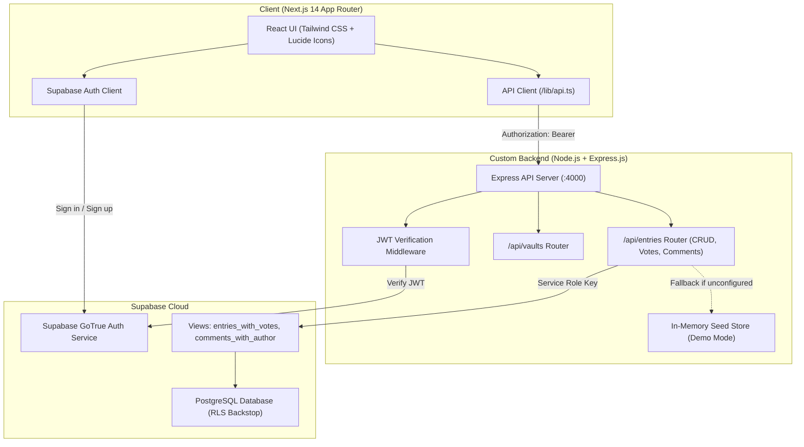

<div align="center">

# 🏛️ CampusVault

### *"Don't let student knowledge graduate."*

A production-grade, collaborative knowledge-preservation platform built for **GitHub Community SRM (GCSRM) Recruitment 2026 — Option A: Mini Collaborative App**.

<br/>

[](https://nextjs.org)
[](https://www.typescriptlang.org)
[](https://expressjs.com)
[](https://supabase.com)
[](https://tailwindcss.com)
[](LICENSE)

<br/>

[🚀 Live Demo](#-live-demo) • [⚡ Quickstart](#-quickstart) • [🏗️ Architecture](#️-architecture) • [📖 API Reference](#-api-reference) • [🚢 Deployment](#-deployment)

</div>

---

## 🎯 The Problem

Every graduating batch takes irreplaceable institutional knowledge with it:

- 📋 **Exact interview questions** from Amazon, Microsoft, and startups — lost to WhatsApp chats
- 📚 **Course intel** — which electives are GPA boosters vs. traps, which professors are harsh in viva
- 🏗️ **Capstone pitfalls** — architectural mistakes and bugs that took weeks to fix
- 🏛️ **Campus secrets** — Wi-Fi spots, reading rooms, club networking shortcuts

**CampusVault** transforms this scattered, ephemeral wisdom into an immutable, searchable, crowdsourced campus repository — so the next batch never starts from scratch.

---

## ✨ Features

| Feature | Description |
|---|---|
| 🗄️ **4 Topic Vaults** | Placements, Course Notes, Projects, Campus Life — structured knowledge categories |
| 🔍 **Live Search** | Debounced cross-vault search with instant result dropdowns |
| 🏅 **Author Badges** | Verified Senior (4th Year) & Alumni mentor badges with branch & year |
| ⬆️ **Upvoting** | Optimistic toggleable upvotes with live count updates |
| 💬 **Comments** | Threaded commenting with author identity on every reply |
| ✍️ **Full CRUD** | Create, read, edit, and delete entries — owner-only enforced server-side |
| 🔐 **Auth + Profiles** | Supabase Auth with student metadata (name, batch year, branch) |
| 🔃 **Sort & Filter** | Sort by Top Upvoted / Newest First · Filter by Seniors & Alumni Only |
| ⚡ **Zero-Config Demo** | Works instantly with no Supabase account — pre-seeded in-memory store |
| 💀 **Loading Skeletons** | Shimmer pulse skeletons for every loading state |
| ❌ **Empty States** | Illustrated empty states with clear calls-to-action |
| 🛡️ **Error Handling** | Network banners, animated toasts, real-time form validation |

---

## 🚀 Live Demo

> 🟡 Deploy your own instance using the [Deployment Guide](#-deployment) below.

| Service | URL |
|---|---|
| 🌐 Frontend (Vercel) | *(Add your Vercel URL after deploying)* |
| ⚙️ Backend API (Render) | *(Add your Render URL after deploying)* |
| 📹 Demo Video | *(Add your walkthrough video link)* |

---

## 🏗️ Architecture

CampusVault uses a clean, decoupled two-service architecture:

```
┌─────────────────────────────────────────────────────┐
│         Browser — Next.js 14 (App Router)           │
│  ┌─────────────┐  ┌───────────┐  ┌───────────────┐  │
│  │  React UI   │  │ Supabase  │  │  API Client   │  │
│  │ (Tailwind)  │  │Auth Client│  │ /lib/api.ts   │  │
│  └──────┬──────┘  └─────┬─────┘  └──────┬────────┘  │
└─────────┼───────────────┼───────────────┼────────────┘
          │               │ Sign in / up  │ Bearer <JWT>
          │         ┌─────▼──────┐        │
          │         │  Supabase  │        │
          │         │ GoTrue Auth│        │
          │         └─────▲──────┘        │
          │               │ Verify JWT    │
┌─────────┼───────────────┼───────────────┼────────────┐
│          Express.js API Server — Node.js (:4000)     │
│                   ┌─────┴──────┐                     │
│                   │    JWT     │◄────────────────────┘
│                   │ Middleware │
│                   └─────┬──────┘
│              ┌──────────┴───────────┐
│         ┌────▼─────┐          ┌─────▼──────┐         │
│         │ /vaults  │          │ /entries   │         │
│         │  Router  │          │   Router   │         │
│         └────┬─────┘          └─────┬──────┘         │
│              └──────────┬───────────┘                │
│                   ┌─────▼──────────────────────┐     │
│                   │   Supabase PostgreSQL DB    │     │
│                   │  (RLS + Views + Triggers)   │     │
│                   └─────────────────────────────┘     │
│                          ↕ fallback (demo mode)       │
│                   ┌─────────────────────────────┐     │
│                   │  In-Memory Demo Store       │     │
│                   │  (mockStore.js — no DB req) │     │
│                   └─────────────────────────────┘     │
└──────────────────────────────────────────────────────┘
```

**Why this architecture?**
- **Separation of Concerns** — Next.js handles SSR/routing; Express handles business logic & auth enforcement
- **Security** — The frontend **never** touches the service role key or talks to PostgreSQL directly
- **Zero-Config Demo** — Backend auto-detects missing Supabase credentials and switches to mock mode

---

## 📁 Project Structure

```
Campus-Vault/
│
├── 📄 package.json              # Root scripts — runs dev concurrently
├── 📄 .gitignore
│
├── 📂 backend/                  # Node.js + Express.js REST API
│   ├── server.js                # App entrypoint, CORS, error handling
│   ├── .env.example             # Environment variable template
│   ├── middleware/
│   │   └── auth.js              # JWT bearer token verification
│   ├── routes/
│   │   ├── vaults.js            # GET /api/vaults
│   │   └── entries.js           # Entries CRUD, search, votes, comments
│   └── lib/
│       ├── supabaseAdmin.js     # Service-role Supabase client
│       └── mockStore.js         # Pre-seeded demo data (zero-config mode)
│
├── 📂 frontend/                 # Next.js 14 (App Router + TypeScript)
│   ├── middleware.ts            # Session refresh middleware
│   ├── app/
│   │   ├── layout.tsx           # Root layout — Navbar + Toast + Footer
│   │   ├── page.tsx             # Home: hero, live search, vault grid
│   │   ├── globals.css          # Design tokens, custom cards, animations
│   │   ├── login/page.tsx       # Sign in / Sign up with test personas
│   │   ├── vault/[slug]/
│   │   │   ├── page.tsx         # Vault feed — sort tabs, senior filter
│   │   │   └── new/
│   │   │       ├── page.tsx     # Auth-gated deposit page
│   │   │       └── NewEntryForm.tsx  # Entry form with real-time validation
│   │   └── entry/[id]/
│   │       └── page.tsx         # Full entry — voting, edit/delete, comments
│   ├── components/
│   │   ├── Navbar.tsx           # Sticky nav with live user avatar & badges
│   │   ├── AuthorBadge.tsx      # Verified Senior / Alumni badge
│   │   ├── Skeleton.tsx         # Shimmer loading skeletons
│   │   ├── EmptyState.tsx       # Illustrated empty state component
│   │   └── Toast.tsx            # Animated notification system
│   └── lib/
│       ├── api.ts               # Typed fetch wrapper with JWT attachment
│       ├── supabaseClient.ts    # Browser Supabase auth client
│       └── types.ts             # TypeScript models (Vault, Entry, Comment)
│
└── 📂 supabase/
    └── schema.sql               # Tables, RLS policies, views, triggers
```

---

## ⚡ Quickstart

### Prerequisites
- **Node.js** v18+
- **npm** v9+

### 1. Clone & Install

```bash
git clone https://github.com/Gurusai-kumar-Gajavalli/Campus-Vault.git
cd Campus-Vault

# Installs root, backend, and frontend dependencies in one command:
npm run install:all
```

### 2. Run in Zero-Config Demo Mode ✨

No Supabase account needed! The backend auto-detects missing credentials and boots with realistic pre-seeded data.

```bash
npm run dev
```

| Service | URL |
|---|---|
| 🌐 Frontend | http://localhost:3000 |
| ⚙️ Backend API | http://localhost:4000 |
| 🏥 API Health Check | http://localhost:4000/api/health |

---

## 🗄️ Connecting Supabase (Live Mode)

1. **Create a free project** at [supabase.com](https://supabase.com)

2. **Run the schema** — open the SQL Editor and run the entire contents of [`supabase/schema.sql`](supabase/schema.sql)

3. **Configure Backend:**
   ```bash
   cp backend/.env.example backend/.env
   ```
   ```env
   SUPABASE_URL=https://your-project-id.supabase.co
   SUPABASE_SERVICE_ROLE_KEY=your-service-role-key
   PORT=4000
   FRONTEND_URL=http://localhost:3000
   ```

4. **Configure Frontend:**
   ```bash
   cp frontend/.env.local.example frontend/.env.local
   ```
   ```env
   NEXT_PUBLIC_SUPABASE_URL=https://your-project-id.supabase.co
   NEXT_PUBLIC_SUPABASE_ANON_KEY=your-anon-key
   NEXT_PUBLIC_API_URL=http://localhost:4000
   ```

5. **Restart** `npm run dev` — both services automatically switch to Live Supabase Mode! 🚀

---

## 📖 API Reference

Base URL: `http://localhost:4000`

| Method | Endpoint | Auth | Description |
|---|---|:---:|---|
| `GET` | `/api/health` | — | Health check + active mode (`demo-mock` or `live-supabase`) |
| `GET` | `/api/vaults` | — | List all vaults with entry counts |
| `GET` | `/api/vaults/:slug` | — | Single vault metadata |
| `GET` | `/api/entries?vault_id=&sort=&year=` | Optional | Vault entries — sort by `top`/`newest`, filter by year |
| `GET` | `/api/entries/search?q=` | — | Cross-vault full-text search |
| `GET` | `/api/entries/:id` | Optional | Entry detail with `hasVoted` & `isOwner` |
| `POST` | `/api/entries` | ✅ | Create a new entry |
| `PUT` | `/api/entries/:id` | ✅ Owner | Edit entry title, content, resource link |
| `DELETE` | `/api/entries/:id` | ✅ Owner | Delete entry + related votes/comments |
| `POST` | `/api/entries/:id/vote` | ✅ | Toggle upvote (atomic) |
| `GET` | `/api/entries/:id/comments` | Optional | List comments with author profile |
| `POST` | `/api/entries/:id/comments` | ✅ | Add a comment |
| `DELETE` | `/api/entries/:id/comments/:commentId` | ✅ Owner | Delete a comment |

---

## 🚢 Deployment

### Backend → Render / Railway

1. Push repository to GitHub
2. Create **New Web Service** on [Render](https://render.com) or [Railway](https://railway.app)
3. Set **Root Directory** → `backend`
4. **Build Command:** `npm install`
5. **Start Command:** `npm start`
6. Add **Environment Variables:** `SUPABASE_URL`, `SUPABASE_SERVICE_ROLE_KEY`, `FRONTEND_URL`, `PORT=4000`

### Frontend → Vercel

1. Import this repository on [Vercel](https://vercel.com)
2. Set **Root Directory** → `frontend`
3. Add **Environment Variables:** `NEXT_PUBLIC_SUPABASE_URL`, `NEXT_PUBLIC_SUPABASE_ANON_KEY`, `NEXT_PUBLIC_API_URL`
4. Click **Deploy** ✅

---

## 🛠️ Tech Stack

| Layer | Technology |
|---|---|
| **Frontend** | Next.js 14 (App Router), React 18, TypeScript |
| **Styling** | Tailwind CSS, Lucide Icons |
| **Backend** | Node.js, Express.js 4 |
| **Database** | Supabase (PostgreSQL), Row-Level Security |
| **Auth** | Supabase GoTrue (JWT-based) |
| **Dev Tools** | concurrently, dotenv, @supabase/ssr |

---

## 📋 GCSRM Evaluation Checklist

| Requirement | Status |
|---|:---:|
| Real database persistence (PostgreSQL) | ✅ |
| Decoupled Node.js + Express.js REST API | ✅ |
| Async state & multi-user mutations | ✅ |
| Responsive, modern UI | ✅ |
| Loading skeletons | ✅ |
| Empty states | ✅ |
| Network error handling & form validation | ✅ |
| **Bonus:** Authentication & student profiles | ✅ |
| **Bonus:** Author ownership — edit & delete | ✅ |
| **Bonus:** Upvoting, sorting & filtering | ✅ |
| **Bonus:** Full-text search (debounced) | ✅ |
| **Bonus:** Zero-config demo mode | ✅ |

---

## 🤝 Contributing

This project is built for GCSRM 2026. Feel free to fork and experiment!

1. Fork the repository
2. Create your branch: `git checkout -b feature/your-feature`
3. Commit changes: `git commit -m 'feat: add your feature'`
4. Push: `git push origin feature/your-feature`
5. Open a Pull Request

---

## 📄 License

Built with ❤️ for **GitHub Community SRM (GCSRM) Recruitment 2026**.  
Open-source under the [MIT License](LICENSE).

---

<div align="center">

Made by **[Gurusai Kumar Gajavalli](https://github.com/Gurusai-kumar-Gajavalli)**

⭐ **Star this repo** if you found it helpful!

</div>


---

## 🚀 Live Demo & Links

- **Live Frontend (Vercel):** [https://campusvault-srm.vercel.app](https://campusvault-srm.vercel.app) *(Replace with your deployed Vercel URL)*
- **Live Backend API (Render/Railway):** [https://campusvault-api.onrender.com](https://campusvault-api.onrender.com) *(Replace with your deployed backend URL)*
- **GitHub Repository:** [https://github.com/your-username/campusvault](https://github.com/your-username/campusvault)
- **Demo Video Walkthrough:** [YouTube / Loom Demo Video Link](https://loom.com)

---

## 1. The Campus Problem

Every single graduating batch takes irreplaceable institutional knowledge with it:
- Which specific electives are scoring vs which are GPA traps.
- Exact on-campus interview questions, OA coding problems, and manager rounds for top companies (Amazon, Microsoft, startups).
- Capstone architecture pitfalls and bugs that took weeks to debug.
- SRM hostel hacks, Wi-Fi spots, reading room secrets, and club networking shortcuts.

Today, this critical wisdom lives in ephemeral WhatsApp chats and word-of-mouth — and disappears the day seniors collect their degrees.

**CampusVault** transforms this scattered knowledge into an immutable, searchable, crowdsourced campus repository. Seniors and alumni deposit battle-tested insights into topic vaults, while juniors discover, filter, upvote, and discuss with the authors.

---

## 2. Evaluation Criteria & Feature Matrix

| GCSRM Requirement | Status | Implementation Details |
|---|:---:|---|
| **Real Database Persistence** | ✅ Complete | Supabase PostgreSQL database with tables (`profiles`, `vaults`, `entries`, `votes`, `comments`) and joined views (`entries_with_votes`, `comments_with_author`). |
| **Decoupled Node.js + Express API** | ✅ Complete | Express.js REST backend running on port 4000. All data reads and writes go through Express, enforcing server-side JWT verification and user ownership. |
| **Asynchronous State & Multi-User Mutations** | ✅ Complete | Live toggleable upvoting, realtime comment threading, full CRUD with author-guarded edits and deletions. |
| **Responsive Modern Interface** | ✅ Complete | Tailwind CSS design system with curated academic palette (deep forest moss, ivory parchment, stone borders, and glowing senior badges). |
| **Loading Skeletons** | ✅ Complete | Custom shimmer pulse loading skeletons for vault cards, entry feeds, search results, and detail views (`<Skeleton />`). |
| **Empty States** | ✅ Complete | Bespoke illustrated empty state cards with direct calls-to-action for unpopulated vaults or filtered views. |
| **Network Errors & Form Validation** | ✅ Complete | Real-time field validation (min length, URL protocols), connection warning banners with retry buttons, and non-intrusive animated toasts. |
| **Bonus: Authentication & Student Profiles** | ✅ Complete | Supabase Auth + Student profile metadata (Full Name, Batch Year `1st Year` to `Alumni`, and Branch `CSE-AIML`, `ECE`, etc.). |
| **Bonus: User Ownership & Edit/Delete** | ✅ Complete | Only the original author can edit or delete their entries or comments (`isOwner` verified server-side). |
| **Bonus: Upvoting & Filtering & Sorting** | ✅ Complete | Toggleable upvotes with optimistic UI updates. Vault feeds support sorting by **"Top Upvoted"** vs **"Newest First"**, and filtering by **"Seniors & Alumni Only"**. |
| **Bonus: Full-Text Search** | ✅ Complete | Debounced live search querying entry titles and content across all vaults with instant result dropdown. |
| **Bonus: Zero-Config Demo Mode** | ✅ Complete | Backend automatically detects missing Supabase keys and boots into an in-memory realistic seed store with 1-click evaluator test personas! |

---

## 3. Architecture Overview

CampusVault uses a clean, two-service decoupled architecture meeting the exact stack specification:



### Why This Architecture?
- **Separation of Concerns:** The Next.js frontend handles SSR, routing, and responsive rendering. The Express.js backend handles business logic, authorization, ownership enforcement, and database transactions.
- **Security:** The frontend **never** touches the service role key or talks to PostgreSQL directly. Express verifies the JWT on every write request before mutating data.

---

## 4. Project Structure

```
GIt_hub_community/
├── package.json               # Root scripts (runs dev concurrently)
├── README.md                  # Complete technical documentation
├── .gitignore                 # Root gitignore
│
├── backend/                   # Node.js + Express.js API
│   ├── server.js              # Express app entrypoint, CORS, centralized error handling
│   ├── package.json           # Backend dependencies
│   ├── .env.example           # Backend environment template
│   ├── middleware/
│   │   └── auth.js            # JWT bearer token verification (live Supabase + demo mode)
│   ├── routes/
│   │   ├── vaults.js          # GET /api/vaults (with live entry counts)
│   │   └── entries.js         # Entries CRUD, search, upvoting, sorting, comments
│   └── lib/
│       ├── supabaseAdmin.js   # Service-role Supabase client with demo fallback
│       └── mockStore.js       # Pre-seeded senior/alumni data for zero-config testing
│
├── frontend/                  # Next.js 14 App Router
│   ├── app/
│   │   ├── layout.tsx         # Root layout with glassmorphic Navbar & ToastProvider
│   │   ├── page.tsx           # Home: Hero, stats, debounced live search, vault grid
│   │   ├── globals.css        # Academic design tokens, custom cards, animations
│   │   ├── login/page.tsx     # Sign in / Sign up with 1-click evaluator personas
│   │   ├── vault/[slug]/
│   │   │   ├── page.tsx       # Vault entries feed, sort tabs, senior filter, empty states
│   │   │   └── new/
│   │   │       ├── page.tsx   # Auth-gated deposit page with breadcrumbs
│   │   │       └── NewEntryForm.tsx # Entry creation form with real-time validation
│   │   └── entry/[id]/
│   │       └── page.tsx       # Full entry view, optimistic voting, edit/delete, comments
│   ├── components/
│   │   ├── Navbar.tsx         # Sticky navigation with live user avatar, badges, logout
│   │   ├── AuthorBadge.tsx    # Verified Senior (4th Year) & Alumni mentor badges
│   │   ├── Skeleton.tsx       # Shimmer loading skeletons
│   │   ├── EmptyState.tsx     # Custom illustrated empty state
│   │   └── Toast.tsx          # Animated notification system
│   └── lib/
│       ├── api.ts             # Typed fetch wrapper attaching JWT tokens
│       ├── supabaseClient.ts  # Browser Supabase auth client
│       ├── supabaseServer.ts  # Server Supabase client
│       └── types.ts           # TypeScript models
│
└── supabase/
    └── schema.sql             # Tables, RLS policies, auto-profile trigger, views
```

---

## 5. Quickstart & Local Setup

### Prerequisites
- Node.js v18+ (tested on v25)
- npm v9+

### 1. Clone and Install Everything
```bash
git clone https://github.com/your-username/campusvault.git
cd campusvault

# Installs root, backend, and frontend dependencies in one command:
npm run install:all
```

### 2. Run in Zero-Config Demo Mode (Immediate Testing!)
No Supabase account is required to test immediately! The backend includes a pre-seeded in-memory store with authentic senior entries (Amazon SDE interview debrief, Operating Systems guide, Capstone post-mortem).

```bash
# Starts Express API on http://localhost:4000
# and Next.js frontend on http://localhost:3000 concurrently:
npm run dev
```

Open [http://localhost:3000](http://localhost:3000) in your browser.

---

## 6. Connecting Your Live Supabase Database

When you are ready to connect a live Supabase PostgreSQL database:

1. Create a free project at [supabase.com](https://supabase.com).
2. Go to the **SQL Editor** in Supabase and run the entire contents of [`supabase/schema.sql`](supabase/schema.sql).
3. In `backend/`:
   ```bash
   cp backend/.env.example backend/.env
   ```
   Fill in:
   ```env
   SUPABASE_URL=https://your-project-id.supabase.co
   SUPABASE_SERVICE_ROLE_KEY=your-supabase-service-role-key
   PORT=4000
   FRONTEND_URL=http://localhost:3000
   ```
4. In `frontend/`:
   ```bash
   cp frontend/.env.local.example frontend/.env.local
   ```
   Fill in:
   ```env
   NEXT_PUBLIC_SUPABASE_URL=https://your-project-id.supabase.co
   NEXT_PUBLIC_SUPABASE_ANON_KEY=your-supabase-anon-key
   NEXT_PUBLIC_API_URL=http://localhost:4000
   ```
5. Restart `npm run dev`. Both services will automatically switch from Demo Mode to Live Supabase Mode!

---

## 7. API Reference

| Method | Route | Auth Required | Description |
|---|---|:---:|---|
| `GET` | `/api/health` | No | API health check and active mode (`demo-mock` or `live-supabase`) |
| `GET` | `/api/vaults` | No | List all topic vaults with live entry counts |
| `GET` | `/api/vaults/:slug` | No | Fetch single vault metadata |
| `GET` | `/api/entries?vault_id=&sort=&year=` | Optional | Entries for a vault, sorted by `top` or `newest`, filtered by student year |
| `GET` | `/api/entries/search?q=` | No | Cross-vault debounced search across titles and content |
| `GET` | `/api/entries/:id` | Optional | Entry detail with author profile, `hasVoted`, and `isOwner` |
| `POST` | `/api/entries` | ✅ Yes | Deposit a new knowledge entry |
| `PUT` | `/api/entries/:id` | ✅ Yes (Owner) | Edit existing entry (title, content, resource link) |
| `DELETE` | `/api/entries/:id` | ✅ Yes (Owner) | Delete existing entry and related votes/comments |
| `POST` | `/api/entries/:id/vote` | ✅ Yes | Toggle user upvote (atomic increment/decrement) |
| `GET` | `/api/entries/:id/comments` | Optional | List comments with author name, year, and branch |
| `POST` | `/api/entries/:id/comments` | ✅ Yes | Add a new comment to an entry |
| `DELETE` | `/api/entries/:id/comments/:commentId` | ✅ Yes (Owner) | Delete a comment |

---

## 8. Deployment Guide

### Deploy Backend (Render or Railway)
1. Push your repository to GitHub.
2. Create a **New Web Service** on [Render](https://render.com) or [Railway](https://railway.app).
3. Set **Root Directory** to `backend`.
4. Build Command: `npm install`
5. Start Command: `npm start`
6. Add Environment Variables:
   - `SUPABASE_URL`
   - `SUPABASE_SERVICE_ROLE_KEY`
   - `FRONTEND_URL` (your deployed Vercel domain)
   - `PORT=4000`

### Deploy Frontend (Vercel)
1. Import your GitHub repository on [Vercel](https://vercel.com).
2. Set **Root Directory** to `frontend`.
3. Add Environment Variables:
   - `NEXT_PUBLIC_SUPABASE_URL`
   - `NEXT_PUBLIC_SUPABASE_ANON_KEY`
   - `NEXT_PUBLIC_API_URL` (your deployed backend URL on Render)
4. Click **Deploy**.

---

## 9. Walkthrough Video Script (Demonstrating Mutations)

Follow this 2-minute script for your submission recording:

1. **Introduction & Pitch (0:00 - 0:20):**
   - Open the homepage: *"This is CampusVault, built for GCSRM Option A. It tackles student knowledge attrition by letting graduating seniors deposit interview debriefs and course lessons."*
   - Highlight the 4 vaults, stats, and search bar.
2. **Debounced Search (0:20 - 0:35):**
   - Type `"Amazon"` in the search bar. Show the instant dropdown results showing Aarav Sharma's interview experience.
3. **Vault Browsing & Filtering (0:35 - 0:50):**
   - Click into the **Placements & Interviews** vault.
   - Toggle between **"Top Upvoted"** and **"Newest First"**.
   - Click **"Seniors & Alumni Only"** filter pill to show verified senior entries.
4. **Authentication & Quick Personas (0:50 - 1:10):**
   - Navigate to `/login`. Demonstrate the 1-click test persona: Click **"Aarav (4th Year)"**.
   - Notice the dynamic Navbar showing Aarav's avatar, name, and **"4th Year"** badge.
5. **Depositing Knowledge (1:10 - 1:30):**
   - Click **"Deposit Knowledge"**.
   - Fill in a new entry: *"Top 5 Electives for 3rd Year CSE students"*.
   - Submit and show the instant redirect to the newly created entry.
6. **Shared Data Mutations: Optimistic Upvote & Comments (1:30 - 1:50):**
   - Toggle the **Upvote** button: Show the active state and animated vote count incrementing.
   - Post a comment: *"Which elective did you find easiest to score an S grade in?"*
   - Show the comment instantly appended with author badge and timestamp.
7. **Author Ownership & Edit/Delete (1:50 - 2:05):**
   - Show the **"Edit"** and **"Delete"** buttons visible to Aarav (the author).
   - Edit the entry title, save, and show the updated view.
8. **Conclusion (2:05 - 2:15):**
   - Briefly open the Network tab to show requests hitting the custom Express API at `http://localhost:4000/api/entries` rather than direct database writes.
   - Conclude on the tagline: *"Don't let student knowledge graduate."*

---

## 10. License

Built with ❤️ for **GitHub Community SRM (GCSRM) Recruitment 2026**.
All code is open-source under the MIT License.
